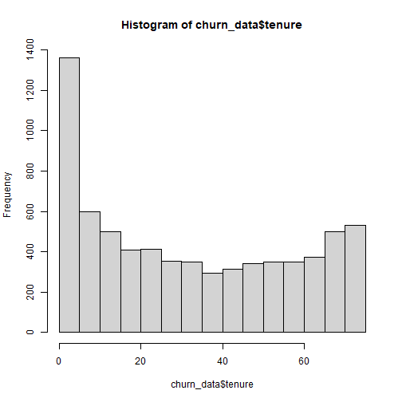
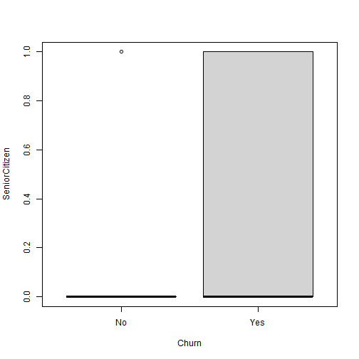
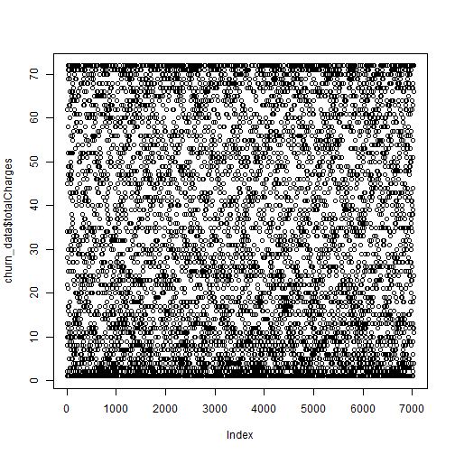
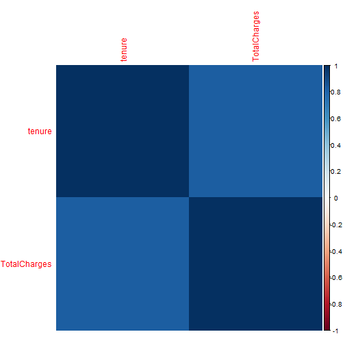
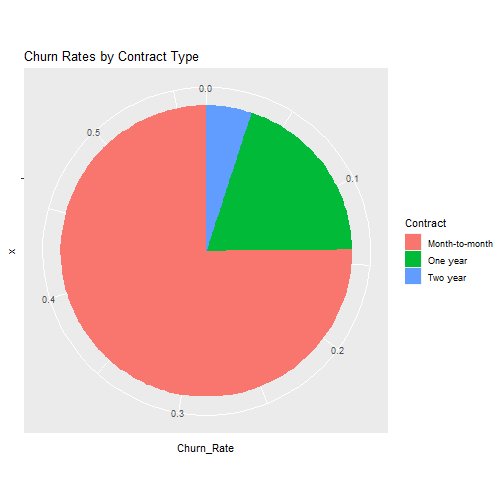
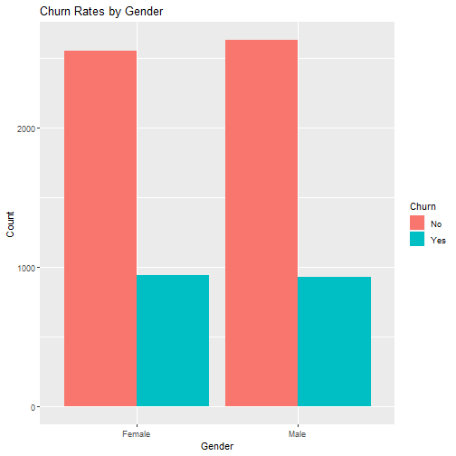

ANALYSIS OF CUSTOMER ATTRITION/CHURN IN A TELECOM COMPANY
================
Francis Kioni

Dataset: Telecom Customer Churn Dataset available on Kaggle
(<https://www.kaggle.com/blastchar/telco-customer-churn>)

``` r
#load libraries
library(ggplot2)
library(rpart)
library(corrplot)
#####Step 1: Import and Clean the Data#####
# Import the Telecom Customer Churn dataset
churn_data <- read.csv("C:/KIONI/brayo/churn.csv", header = TRUE)
# Remove missing values
churn_data <- na.omit(churn_data)

# Remove outliers
churn_data <- churn_data[churn_data$tenure <= 100, ]

##Exploratory data analysis
# Descriptive statistics
summary(churn_data)
```

    ##   customerID           gender          SeniorCitizen      Partner           Dependents       
    ##  Length:7032        Length:7032        Min.   :0.0000   Length:7032        Length:7032       
    ##  Class :character   Class :character   1st Qu.:0.0000   Class :character   Class :character  
    ##  Mode  :character   Mode  :character   Median :0.0000   Mode  :character   Mode  :character  
    ##                                        Mean   :0.1624                                        
    ##                                        3rd Qu.:0.0000                                        
    ##                                        Max.   :1.0000                                        
    ##      tenure      PhoneService       MultipleLines      InternetService    OnlineSecurity    
    ##  Min.   : 1.00   Length:7032        Length:7032        Length:7032        Length:7032       
    ##  1st Qu.: 9.00   Class :character   Class :character   Class :character   Class :character  
    ##  Median :29.00   Mode  :character   Mode  :character   Mode  :character   Mode  :character  
    ##  Mean   :32.42                                                                              
    ##  3rd Qu.:55.00                                                                              
    ##  Max.   :72.00                                                                              
    ##  OnlineBackup       DeviceProtection   TechSupport        StreamingTV        StreamingMovies   
    ##  Length:7032        Length:7032        Length:7032        Length:7032        Length:7032       
    ##  Class :character   Class :character   Class :character   Class :character   Class :character  
    ##  Mode  :character   Mode  :character   Mode  :character   Mode  :character   Mode  :character  
    ##                                                                                                
    ##                                                                                                
    ##                                                                                                
    ##    Contract         PaperlessBilling   PaymentMethod      MonthlyCharges    TotalCharges   
    ##  Length:7032        Length:7032        Length:7032        Min.   : 18.25   Min.   :  18.8  
    ##  Class :character   Class :character   Class :character   1st Qu.: 35.59   1st Qu.: 401.4  
    ##  Mode  :character   Mode  :character   Mode  :character   Median : 70.35   Median :1397.5  
    ##                                                           Mean   : 64.80   Mean   :2283.3  
    ##                                                           3rd Qu.: 89.86   3rd Qu.:3794.7  
    ##                                                           Max.   :118.75   Max.   :8684.8  
    ##     Churn          
    ##  Length:7032       
    ##  Class :character  
    ##  Mode  :character  
    ##                    
    ##                    
    ## 

``` r
# Histogram of tenure
hist(churn_data$tenure)
```



``` r
# Boxplot of monthly charges by churn
boxplot(SeniorCitizen ~ Churn, data = churn_data)
```



From the above plots, senior citizens (1) had more churn rate as
compared to the non senior citizens (0). The monthly charges as they
increase see the churn rate also increase.

``` r
# Scatterplot of total charges by tenure
plot(churn_data$tenure, churn_data$totalCharges)
```



A correlation analysis of total charge and tenure was carried out to
estimate the relation between them. The high the charges the higher the
tenure

``` r
# Heatmap of correlations
cor_matrix <- cor(churn_data[, c(6, 20)])
corrplot(cor_matrix, method = "color")
```



``` r
##statistical analysis
# Correlation analysis
cor(churn_data[, c(6, 20)])
```

    ##                 tenure TotalCharges
    ## tenure       1.0000000    0.8258805
    ## TotalCharges 0.8258805    1.0000000

``` r
# Decision tree

tree_model <- rpart(Churn ~ tenure + MonthlyCharges + Contract + PaymentMethod + OnlineSecurity + TechSupport, data = churn_data, method = "class")
summary(tree_model)
```

    ## Call:
    ## rpart(formula = Churn ~ tenure + MonthlyCharges + Contract + 
    ##     PaymentMethod + OnlineSecurity + TechSupport, data = churn_data, 
    ##     method = "class")
    ##   n= 7032 
    ## 
    ##           CP nsplit rel error    xerror       xstd
    ## 1 0.05903335      0 1.0000000 1.0000000 0.01982015
    ## 2 0.02140182      3 0.8228999 0.8362761 0.01865455
    ## 3 0.01000000      5 0.7800963 0.8116640 0.01845512
    ## 
    ## Variable importance
    ##       Contract         tenure OnlineSecurity    TechSupport MonthlyCharges  PaymentMethod 
    ##             29             22             17             14             10              8 
    ## 
    ## Node number 1: 7032 observations,    complexity param=0.05903335
    ##   predicted class=No   expected loss=0.265785  P(node) =1
    ##     class counts:  5163  1869
    ##    probabilities: 0.734 0.266 
    ##   left son=2 (3157 obs) right son=3 (3875 obs)
    ##   Primary splits:
    ##       Contract       splits as  RLL,        improve=449.1984, (0 missing)
    ##       OnlineSecurity splits as  RLL,        improve=321.4489, (0 missing)
    ##       TechSupport    splits as  RLL,        improve=311.4623, (0 missing)
    ##       tenure         < 16.5   to the right, improve=295.0073, (0 missing)
    ##       PaymentMethod  splits as  LLRL,       improve=249.4058, (0 missing)
    ##   Surrogate splits:
    ##       tenure         < 34.5   to the right, agree=0.792, adj=0.536, (0 split)
    ##       TechSupport    splits as  RLL,        agree=0.717, adj=0.371, (0 split)
    ##       OnlineSecurity splits as  RLL,        agree=0.700, adj=0.332, (0 split)
    ##       PaymentMethod  splits as  LLRR,       agree=0.665, adj=0.253, (0 split)
    ##       MonthlyCharges < 27.675 to the left,  agree=0.608, adj=0.127, (0 split)
    ## 
    ## Node number 2: 3157 observations
    ##   predicted class=No   expected loss=0.06778587  P(node) =0.4489477
    ##     class counts:  2943   214
    ##    probabilities: 0.932 0.068 
    ## 
    ## Node number 3: 3875 observations,    complexity param=0.05903335
    ##   predicted class=No   expected loss=0.4270968  P(node) =0.5510523
    ##     class counts:  2220  1655
    ##    probabilities: 0.573 0.427 
    ##   left son=6 (1244 obs) right son=7 (2631 obs)
    ##   Primary splits:
    ##       OnlineSecurity splits as  RLL,        improve=113.88620, (0 missing)
    ##       MonthlyCharges < 68.625 to the left,  improve=103.50820, (0 missing)
    ##       TechSupport    splits as  RLL,        improve=102.07470, (0 missing)
    ##       PaymentMethod  splits as  LLRL,       improve= 85.98362, (0 missing)
    ##       tenure         < 5.5    to the right, improve= 72.11510, (0 missing)
    ##   Surrogate splits:
    ##       TechSupport    splits as  RLR,        agree=0.814, adj=0.421, (0 split)
    ##       MonthlyCharges < 24.125 to the left,  agree=0.804, adj=0.389, (0 split)
    ##       PaymentMethod  splits as  RRRL,       agree=0.692, adj=0.041, (0 split)
    ##       tenure         < 69.5   to the right, agree=0.679, adj=0.001, (0 split)
    ## 
    ## Node number 6: 1244 observations
    ##   predicted class=No   expected loss=0.2508039  P(node) =0.1769056
    ##     class counts:   932   312
    ##    probabilities: 0.749 0.251 
    ## 
    ## Node number 7: 2631 observations,    complexity param=0.05903335
    ##   predicted class=Yes  expected loss=0.4895477  P(node) =0.3741468
    ##     class counts:  1288  1343
    ##    probabilities: 0.490 0.510 
    ##   left son=14 (1580 obs) right son=15 (1051 obs)
    ##   Primary splits:
    ##       tenure         < 7.5    to the right, improve=75.65372, (0 missing)
    ##       MonthlyCharges < 69.175 to the left,  improve=41.78772, (0 missing)
    ##       PaymentMethod  splits as  LLRL,       improve=39.46925, (0 missing)
    ##       TechSupport    splits as  R-L,        improve=33.27230, (0 missing)
    ##   Surrogate splits:
    ##       MonthlyCharges < 75.175 to the right, agree=0.639, adj=0.095, (0 split)
    ##       PaymentMethod  splits as  LLLR,       agree=0.633, adj=0.081, (0 split)
    ## 
    ## Node number 14: 1580 observations,    complexity param=0.02140182
    ##   predicted class=No   expected loss=0.4126582  P(node) =0.2246871
    ##     class counts:   928   652
    ##    probabilities: 0.587 0.413 
    ##   left son=28 (505 obs) right son=29 (1075 obs)
    ##   Primary splits:
    ##       MonthlyCharges < 73.825 to the left,  improve=39.51496, (0 missing)
    ##       PaymentMethod  splits as  LLRL,       improve=25.82646, (0 missing)
    ##       TechSupport    splits as  R-L,        improve=13.88294, (0 missing)
    ##       tenure         < 16.5   to the right, improve=11.33279, (0 missing)
    ##   Surrogate splits:
    ##       PaymentMethod splits as  RRRL, agree=0.712, adj=0.099, (0 split)
    ## 
    ## Node number 15: 1051 observations
    ##   predicted class=Yes  expected loss=0.3425309  P(node) =0.1494596
    ##     class counts:   360   691
    ##    probabilities: 0.343 0.657 
    ## 
    ## Node number 28: 505 observations
    ##   predicted class=No   expected loss=0.249505  P(node) =0.07181456
    ##     class counts:   379   126
    ##    probabilities: 0.750 0.250 
    ## 
    ## Node number 29: 1075 observations,    complexity param=0.02140182
    ##   predicted class=No   expected loss=0.4893023  P(node) =0.1528726
    ##     class counts:   549   526
    ##    probabilities: 0.511 0.489 
    ##   left son=58 (767 obs) right son=59 (308 obs)
    ##   Primary splits:
    ##       tenure         < 16.5   to the right, improve=17.059470, (0 missing)
    ##       PaymentMethod  splits as  LLRL,       improve=12.033800, (0 missing)
    ##       TechSupport    splits as  R-L,        improve=10.213900, (0 missing)
    ##       MonthlyCharges < 95.975 to the left,  improve= 4.474442, (0 missing)
    ##   Surrogate splits:
    ##       MonthlyCharges < 75.275 to the right, agree=0.718, adj=0.016, (0 split)
    ## 
    ## Node number 58: 767 observations
    ##   predicted class=No   expected loss=0.4328553  P(node) =0.1090728
    ##     class counts:   435   332
    ##    probabilities: 0.567 0.433 
    ## 
    ## Node number 59: 308 observations
    ##   predicted class=Yes  expected loss=0.3701299  P(node) =0.04379977
    ##     class counts:   114   194
    ##    probabilities: 0.370 0.630

### decison tree algorithm

The decision tree explain the most significant factors that lead to
customer churn. Contract, Tenure, online security and tech support were
the most significant variables with the contract type carrying the most
weight. From the decision tree a pie chart was created to examine in
depth the way different contracts lead to churn

``` r
##visualization
# Bar chart of churn rates by gender
df<-data.frame(churn_data)
churn_data$Churn <- ifelse(churn_data$Churn == "Yes", 1, ifelse(churn_data$Churn == "No", 0, ""))
churn_data$Churn <- as.numeric(churn_data$Churn)
churn_data$gender <- ifelse(churn_data$gender == "Male", 1, ifelse(churn_data$gender == "Female", 0, ""))

 
# Pie chart of churn rates by contract type
contract_churn <- aggregate(churn_data$Churn, by = list(churn_data$Contract), FUN = mean)
names(contract_churn) <- c("Contract", "Churn_Rate")
ggplot(contract_churn, aes(x = "", y = Churn_Rate, fill = Contract)) +
  geom_bar(stat = "identity", width = 1) +
  coord_polar(theta = "y") +
  labs(title = "Churn Rates by Contract Type", fill = "Contract")
```



From the above pie chart the churn rate is very high in customers having
month-to-month contract. The two year contracts have the lowest level of
attrition in this case.

``` r
#Bar chart of churn rates by gender
churn_data <- read.csv("C:/KIONI/brayo/churn.csv", header = TRUE)
ggplot(churn_data, aes(x = gender, fill = Churn)) +
  geom_bar(position=position_dodge()) +
  labs(title = "Churn Rates by Gender", x = "Gender", y = "Count")
```



Female clients are more prone to churn than their male counterparts.

### RECOMMENDATIONS

A recommendation would be that the companies to adopt annual or 2 year
contract plans than use the monthly contracts. Improving tech support
and online security will also reduce the churn rate.
