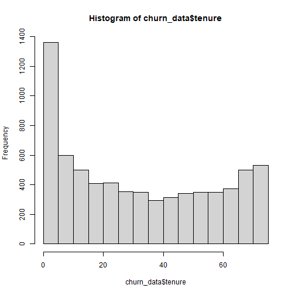
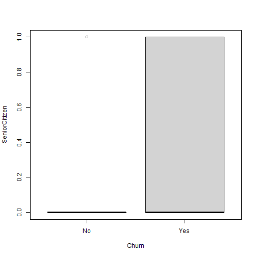
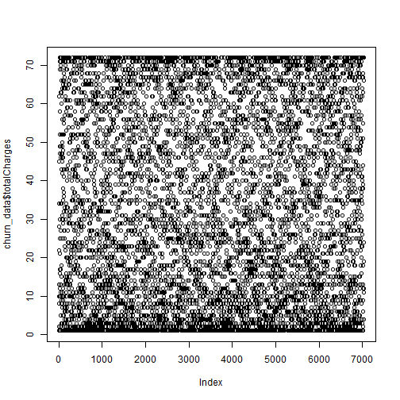
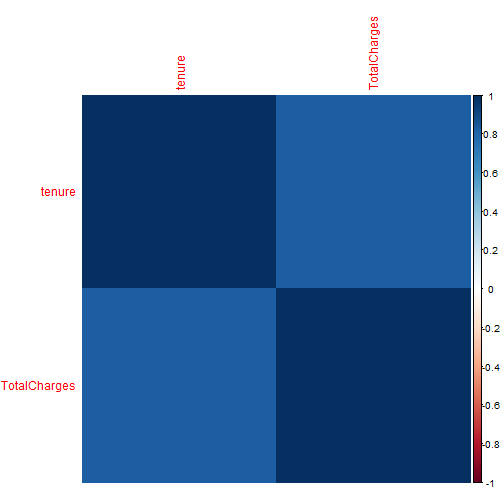
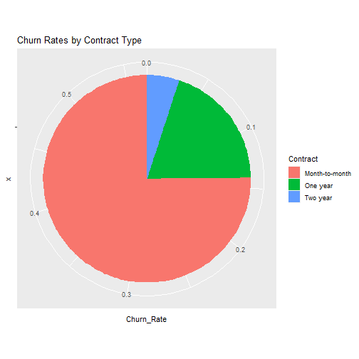
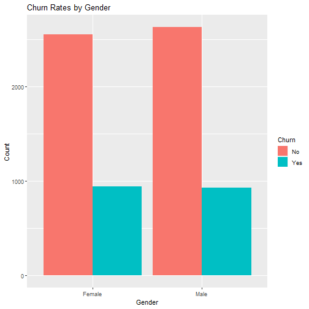

Dataset: Telecom Customer Churn Dataset available on Kaggle (https://www.kaggle.com/blastchar/telco-customer-churn)

RESEARCH QUESTION

To establish which factors cause customer churn and how can the telecommunication companies reduce customer attrition.

OBJECTIVES
I.	Identify relationships in the data

II.	Identify factors that contribute to the high attrition rate

III.	Visualize the findings

IV.	Give recommendations to the company

APPROACH

1.	The data was read in Rstudio and outliers removed.
2.	Exploratory data analysis was carried out to show descriptive statistics of the data. Histograms, scatter plots and boxplots were explored.
3.	Statistical analysis was carried out to identify the factors that are mostly related to customer attrition. Correlation analysis, simple logistic regression and decision trees were explored.

RELATED WORK

1.Ashish Sharma, Prafullit Shukla, Mahendra Kumar Gourisaria, Bhisham Sharma, Imed Ben Dhaou, "Telecom Churn Analysis using Machine Learning in Smart Cities", 2023 1st International Conference on Advanced Innovations in Smart Cities (ICAISC), pp.1-5, 2023.

2.Puneeth B. R, Preethi Salian K, Prathyakshini, Anantha Murthy, Supriya Salian, Surabhi, "Analysis of Telecom Churn using Machine Learning Techniques", 2022 International Conference on Artificial Intelligence and Data Engineering (AIDE), pp.58-63, 2022.

3.Henwy Wibowo, Kristina Pestaria Sinaga, "Telecommunication Analytics Based on Customer Segmentation Using Unsupervised Algorithms", 2021 3rd International Conference on Cybernetics and Intelligent System (ICORIS), pp.1-6, 2021.

4.Lawchak Fadhil Khalid, Adnan Mohsin Abdulazeez, Diyar Qader Zeebaree, Falah Y. H. Ahmed, Dilovan Asaad Zebari, "Customer Churn Prediction in Telecommunications Industry Based on Data Mining", 2021 IEEE Symposium on Industrial Electronics & Applications (ISIEA), pp.1-6, 2021.

5.Shuli Wu, Wei-Chuen Yau, Thian-Song Ong, Siew-Chin Chong, "Integrated Churn Prediction and Customer Segmentation Framework for Telco Business", IEEE Access, vol.9, pp.62118-62136, 2021.

6.Jaehyun Ahn, Junsik Hwang, Doyoung Kim, Hyukgeun Choi, Shinjin Kang, "A Survey on Churn Analysis in Various Business Domains", IEEE Access, vol.8, pp.220816-220839, 2020.

7.Nyashadzashe Tamuka, Khulumani Sibanda, "Real Time Customer Churn Scoring Model for the Telecommunications Industry", 2020 2nd International Multidisciplinary Information Technology and Engineering Conference (IMITEC), pp.1-9, 2020.
```r
#load libraries
library(ggplot2)
library(rpart)
library(corrplot)
#####Step 1: Import and Clean the Data#####
# Import the Telecom Customer Churn dataset
churn_data <- read.csv("C:/KIONI/brayo/churn.csv", header = TRUE)
# Remove missing values
churn_data <- na.omit(churn_data)

# Remove outliers
churn_data <- churn_data[churn_data$tenure <= 100, ]

##Exploratory data analysis
# Descriptive statistics
summary(churn_data)
```

```
##   customerID           gender          SeniorCitizen      Partner           Dependents       
##  Length:7032        Length:7032        Min.   :0.0000   Length:7032        Length:7032       
##  Class :character   Class :character   1st Qu.:0.0000   Class :character   Class :character  
##  Mode  :character   Mode  :character   Median :0.0000   Mode  :character   Mode  :character  
##                                        Mean   :0.1624                                        
##                                        3rd Qu.:0.0000                                        
##                                        Max.   :1.0000                                        
##      tenure      PhoneService       MultipleLines      InternetService    OnlineSecurity    
##  Min.   : 1.00   Length:7032        Length:7032        Length:7032        Length:7032       
##  1st Qu.: 9.00   Class :character   Class :character   Class :character   Class :character  
##  Median :29.00   Mode  :character   Mode  :character   Mode  :character   Mode  :character  
##  Mean   :32.42                                                                              
##  3rd Qu.:55.00                                                                              
##  Max.   :72.00                                                                              
##  OnlineBackup       DeviceProtection   TechSupport        StreamingTV        StreamingMovies   
##  Length:7032        Length:7032        Length:7032        Length:7032        Length:7032       
##  Class :character   Class :character   Class :character   Class :character   Class :character  
##  Mode  :character   Mode  :character   Mode  :character   Mode  :character   Mode  :character  
##                                                                                                
##                                                                                                
##                                                                                                
##    Contract         PaperlessBilling   PaymentMethod      MonthlyCharges    TotalCharges   
##  Length:7032        Length:7032        Length:7032        Min.   : 18.25   Min.   :  18.8  
##  Class :character   Class :character   Class :character   1st Qu.: 35.59   1st Qu.: 401.4  
##  Mode  :character   Mode  :character   Mode  :character   Median : 70.35   Median :1397.5  
##                                                           Mean   : 64.80   Mean   :2283.3  
##                                                           3rd Qu.: 89.86   3rd Qu.:3794.7  
##                                                           Max.   :118.75   Max.   :8684.8  
##     Churn          
##  Length:7032       
##  Class :character  
##  Mode  :character  
##                    
##                    
## 
```

```r
# Histogram of tenure
hist(churn_data$tenure)
```



```r
# Boxplot of monthly charges by churn
boxplot(SeniorCitizen ~ Churn, data = churn_data)
```



From the above plots, senior citizens (1)  had more churn rate as compared to the non senior citizens (0). The monthly charges as they increase see the churn rate also increase.
```r
# Scatterplot of total charges by tenure
plot(churn_data$tenure, churn_data$totalCharges)
```



A correlation analysis of total charge and tenure was carried out to estimate the relation between them. The high the charges the higher the tenure

```r
# Heatmap of correlations
cor_matrix <- cor(churn_data[, c(6, 20)])
corrplot(cor_matrix, method = "color")
```



```r
##statistical analysis
# Correlation analysis
cor(churn_data[, c(6, 20)])
```

```
##                 tenure TotalCharges
## tenure       1.0000000    0.8258805
## TotalCharges 0.8258805    1.0000000
```

```r
# Decision tree

tree_model <- rpart(Churn ~ tenure + MonthlyCharges + Contract + PaymentMethod + OnlineSecurity + TechSupport, data = churn_data, method = "class")
summary(tree_model)
```

```
## Call:
## rpart(formula = Churn ~ tenure + MonthlyCharges + Contract + 
##     PaymentMethod + OnlineSecurity + TechSupport, data = churn_data, 
##     method = "class")
##   n= 7032 
## 
##           CP nsplit rel error    xerror       xstd
## 1 0.05903335      0 1.0000000 1.0000000 0.01982015
## 2 0.02140182      3 0.8228999 0.8362761 0.01865455
## 3 0.01000000      5 0.7800963 0.8116640 0.01845512
## 
## Variable importance
##       Contract         tenure OnlineSecurity    TechSupport MonthlyCharges  PaymentMethod 
##             29             22             17             14             10              8 
## 
## Node number 1: 7032 observations,    complexity param=0.05903335
##   predicted class=No   expected loss=0.265785  P(node) =1
##     class counts:  5163  1869
##    probabilities: 0.734 0.266 
##   left son=2 (3157 obs) right son=3 (3875 obs)
##   Primary splits:
##       Contract       splits as  RLL,        improve=449.1984, (0 missing)
##       OnlineSecurity splits as  RLL,        improve=321.4489, (0 missing)
##       TechSupport    splits as  RLL,        improve=311.4623, (0 missing)
##       tenure         < 16.5   to the right, improve=295.0073, (0 missing)
##       PaymentMethod  splits as  LLRL,       improve=249.4058, (0 missing)
##   Surrogate splits:
##       tenure         < 34.5   to the right, agree=0.792, adj=0.536, (0 split)
##       TechSupport    splits as  RLL,        agree=0.717, adj=0.371, (0 split)
##       OnlineSecurity splits as  RLL,        agree=0.700, adj=0.332, (0 split)
##       PaymentMethod  splits as  LLRR,       agree=0.665, adj=0.253, (0 split)
##       MonthlyCharges < 27.675 to the left,  agree=0.608, adj=0.127, (0 split)
## 
## Node number 2: 3157 observations
##   predicted class=No   expected loss=0.06778587  P(node) =0.4489477
##     class counts:  2943   214
##    probabilities: 0.932 0.068 
## 
## Node number 3: 3875 observations,    complexity param=0.05903335
##   predicted class=No   expected loss=0.4270968  P(node) =0.5510523
##     class counts:  2220  1655
##    probabilities: 0.573 0.427 
##   left son=6 (1244 obs) right son=7 (2631 obs)
##   Primary splits:
##       OnlineSecurity splits as  RLL,        improve=113.88620, (0 missing)
##       MonthlyCharges < 68.625 to the left,  improve=103.50820, (0 missing)
##       TechSupport    splits as  RLL,        improve=102.07470, (0 missing)
##       PaymentMethod  splits as  LLRL,       improve= 85.98362, (0 missing)
##       tenure         < 5.5    to the right, improve= 72.11510, (0 missing)
##   Surrogate splits:
##       TechSupport    splits as  RLR,        agree=0.814, adj=0.421, (0 split)
##       MonthlyCharges < 24.125 to the left,  agree=0.804, adj=0.389, (0 split)
##       PaymentMethod  splits as  RRRL,       agree=0.692, adj=0.041, (0 split)
##       tenure         < 69.5   to the right, agree=0.679, adj=0.001, (0 split)
## 
## Node number 6: 1244 observations
##   predicted class=No   expected loss=0.2508039  P(node) =0.1769056
##     class counts:   932   312
##    probabilities: 0.749 0.251 
## 
## Node number 7: 2631 observations,    complexity param=0.05903335
##   predicted class=Yes  expected loss=0.4895477  P(node) =0.3741468
##     class counts:  1288  1343
##    probabilities: 0.490 0.510 
##   left son=14 (1580 obs) right son=15 (1051 obs)
##   Primary splits:
##       tenure         < 7.5    to the right, improve=75.65372, (0 missing)
##       MonthlyCharges < 69.175 to the left,  improve=41.78772, (0 missing)
##       PaymentMethod  splits as  LLRL,       improve=39.46925, (0 missing)
##       TechSupport    splits as  R-L,        improve=33.27230, (0 missing)
##   Surrogate splits:
##       MonthlyCharges < 75.175 to the right, agree=0.639, adj=0.095, (0 split)
##       PaymentMethod  splits as  LLLR,       agree=0.633, adj=0.081, (0 split)
## 
## Node number 14: 1580 observations,    complexity param=0.02140182
##   predicted class=No   expected loss=0.4126582  P(node) =0.2246871
##     class counts:   928   652
##    probabilities: 0.587 0.413 
##   left son=28 (505 obs) right son=29 (1075 obs)
##   Primary splits:
##       MonthlyCharges < 73.825 to the left,  improve=39.51496, (0 missing)
##       PaymentMethod  splits as  LLRL,       improve=25.82646, (0 missing)
##       TechSupport    splits as  R-L,        improve=13.88294, (0 missing)
##       tenure         < 16.5   to the right, improve=11.33279, (0 missing)
##   Surrogate splits:
##       PaymentMethod splits as  RRRL, agree=0.712, adj=0.099, (0 split)
## 
## Node number 15: 1051 observations
##   predicted class=Yes  expected loss=0.3425309  P(node) =0.1494596
##     class counts:   360   691
##    probabilities: 0.343 0.657 
## 
## Node number 28: 505 observations
##   predicted class=No   expected loss=0.249505  P(node) =0.07181456
##     class counts:   379   126
##    probabilities: 0.750 0.250 
## 
## Node number 29: 1075 observations,    complexity param=0.02140182
##   predicted class=No   expected loss=0.4893023  P(node) =0.1528726
##     class counts:   549   526
##    probabilities: 0.511 0.489 
##   left son=58 (767 obs) right son=59 (308 obs)
##   Primary splits:
##       tenure         < 16.5   to the right, improve=17.059470, (0 missing)
##       PaymentMethod  splits as  LLRL,       improve=12.033800, (0 missing)
##       TechSupport    splits as  R-L,        improve=10.213900, (0 missing)
##       MonthlyCharges < 95.975 to the left,  improve= 4.474442, (0 missing)
##   Surrogate splits:
##       MonthlyCharges < 75.275 to the right, agree=0.718, adj=0.016, (0 split)
## 
## Node number 58: 767 observations
##   predicted class=No   expected loss=0.4328553  P(node) =0.1090728
##     class counts:   435   332
##    probabilities: 0.567 0.433 
## 
## Node number 59: 308 observations
##   predicted class=Yes  expected loss=0.3701299  P(node) =0.04379977
##     class counts:   114   194
##    probabilities: 0.370 0.630
```
### decison tree algorithm
The decision tree explain the most significant factors that lead to customer churn. Contract, Tenure, online security and tech support were the most significant variables with the contract type carrying the most weight. From the decision tree a pie chart was created to examine in depth the way different contracts lead to churn
```r
##visualization
# Bar chart of churn rates by gender
df<-data.frame(churn_data)
churn_data$Churn <- ifelse(churn_data$Churn == "Yes", 1, ifelse(churn_data$Churn == "No", 0, ""))
churn_data$Churn <- as.numeric(churn_data$Churn)
churn_data$gender <- ifelse(churn_data$gender == "Male", 1, ifelse(churn_data$gender == "Female", 0, ""))

 
# Pie chart of churn rates by contract type
contract_churn <- aggregate(churn_data$Churn, by = list(churn_data$Contract), FUN = mean)
names(contract_churn) <- c("Contract", "Churn_Rate")
ggplot(contract_churn, aes(x = "", y = Churn_Rate, fill = Contract)) +
  geom_bar(stat = "identity", width = 1) +
  coord_polar(theta = "y") +
  labs(title = "Churn Rates by Contract Type", fill = "Contract")
```



From the above pie chart the churn rate is very high in customers having month-to-month contract. The two year contracts have the lowest level of attrition in this case. 

```r
#Bar chart of churn rates by gender
churn_data <- read.csv("C:/KIONI/brayo/churn.csv", header = TRUE)
ggplot(churn_data, aes(x = gender, fill = Churn)) +
  geom_bar(position=position_dodge()) +
  labs(title = "Churn Rates by Gender", x = "Gender", y = "Count")
```



Female clients are more prone to churn than their male counterparts.

### RECOMMENDATIONS
A recommendation would be that the companies to adopt annual or 2 year contract plans than use the monthly contracts.  Improving tech support and online security will also reduce the churn rate.

